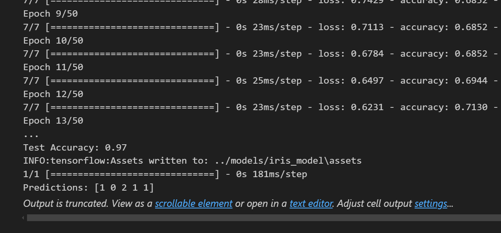

# 🌸 Iris Flower Classification with TensorFlow

A beginner-friendly project to classify Iris flower species (Setosa, Versicolor, Virginica) using a neural network built with TensorFlow and Keras. The model predicts the species based on petal and sepal measurements.

---

## 📊 Dataset Overview

- **Source:** [Iris Dataset (Wikipedia)](https://en.wikipedia.org/wiki/Iris_flower_data_set)
- **Features:**
  - Sepal Length
  - Sepal Width
  - Petal Length
  - Petal Width
- **Labels:**
  - `0`: Setosa
  - `1`: Versicolor
  - `2`: Virginica

---

## 🧠 Model Architecture

- **Input Layer:** 4 nodes (one for each feature)
- **Hidden Layer 1:** 16 neurons, ReLU activation
- **Hidden Layer 2:** 12 neurons, ReLU activation
- **Output Layer:** 3 neurons, Softmax activation (for 3-class classification)

---

## 🚀 Getting Started

### 1. Clone the Repository

```bash
# Clone and enter the project directory
git clone https://github.com/your-username/iris-flower-classification-tensorflow.git
cd iris-flower-classification-tensorflow
```

### 2. Install Requirements

```bash
pip install -r requirements.txt
```

### 3. Explore the Data

- Open `notebooks/00_iris_data_overview.ipynb` to view and understand the dataset.

### 4. Train & Evaluate the Model

- Run `notebooks/01_iris_classifier.ipynb` to train, validate, and test the neural network.
- The model is saved to `models/iris_model/` after training.

---

## 🗂️ Project Structure

```
.
├── data/                        # (Optional) Place for raw or processed data
├── models/
│   └── iris_model/              # Saved TensorFlow model
├── notebooks/
│   ├── 00_iris_data_overview.ipynb   # Data exploration and visualization
│   └── 01_iris_classifier.ipynb      # Model training, evaluation, and saving
├── requirements.txt             # Python dependencies
└── README.md
```

---

## 💾 Model Usage

- The trained model is saved in `models/iris_model/`.
- You can load and use it for predictions without retraining:

```python
import tensorflow as tf
model = tf.keras.models.load_model('models/iris_model')
# Use model.predict(...) as needed
```

---

## 📚 Key Learnings

- Data preprocessing & standardization
- Train-test split
- Neural network design with Keras
- Model evaluation
- Model saving/loading
- Making predictions with TensorFlow

---

## 📸 Screenshots

Screenshots of terminal output, model accuracy, or graphs (e.g., from TensorBoard or matplotlib) can be saved in the `notebooks/screenshots/` directory.

> **Tip:** Create the `notebooks/screenshots/` folder if it doesn't exist, and save your images there for easy reference and sharing.

Example:

```
notebooks/
├── 00_iris_data_overview.ipynb
├── 01_iris_classifier.ipynb
└── screenshots/
    ├── accuracy_plot.png
    └── terminal_output.png
```

Model Summary:



---

## 📘 License

This project is open-source under the MIT License.

---
